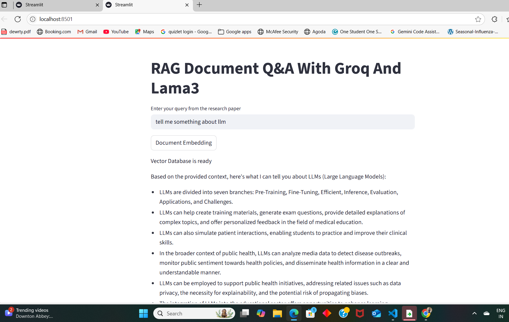

# RAG-PDF-LLAMA-GROQ — Research Paper Q&A Assistant

An intelligent **Retrieval-Augmented Generation (RAG)** application to query research papers using natural language.  
Built using **LangChain**, **FAISS**, **HuggingFace Embeddings**, **Groq’s LLaMA3**, and **Streamlit**.

---

## + Key Features
- Processes PDF documents from research_papers folder
- Uses HuggingFace embeddings for document vectorization
- Implements FAISS for efficient similarity search
- Powered by Groq's LLaMA3 model for responses
- Simple Streamlit web interface


## + Requirements
- langchain
- python-dotenv
- ipykernel
- langchain-community
- pypdf
- bs4
- arxiv
- pymupdf
- wikipedia
- langchain-text-splitters
- langchain-openai
- chromadb
- sentence_transformers
- langchain_huggingface
- faiss-cpu
- langchain_chroma
- duckdb
- pandas
- openai
- langchain-groq
- duckduckgo_search==5.3.1b1
- pymupdf
- arxiv
- wikipedia
- mysql-connector-python
- SQLAlchemy
- validators==0.28.1
- youtube_transcript_api
- unstructured
- pytube
- numexpr
- huggingface_hub

## +Technical Stack
- LangChain (RAG pipeline)
- HuggingFace (embeddings)
- FAISS (vector storage)
- Groq (LLaMA3 LLM)
- Streamlit (UI)

### Install Dependencies

```bash
pip install -r requirements.txt
```


## + Environment Variables Setup
Create a .env file in the root directory with your keys:
```
OPENAI_API_KEY=your_openai_key
GROQ_API_KEY=your_groq_key
HF_TOKEN=your_huggingface_token

.env
```

## + How It Works
1. PDFs → Chunked → Vectorized (FAISS)
2. User question → Finds relevant text chunks
3. LLaMA3 generates answer from context
   
## + Folder Structure

```
project-root/
│
├── app.py                 # Main Streamlit application
├── requirements.txt       # Python dependencies
├── .gitignore             # Ignore sensitive files
├── .env                   # API keys (should NOT be pushed)
├── rag_pdf_groq.png       # Screenshot/demo image
├── research_papers/       # Folder of input PDFs
│   ├── LLM.pdf
│   └── Attention.pdf
```


 Access the app at: 
```
http://localhost:8501 after launching
```



